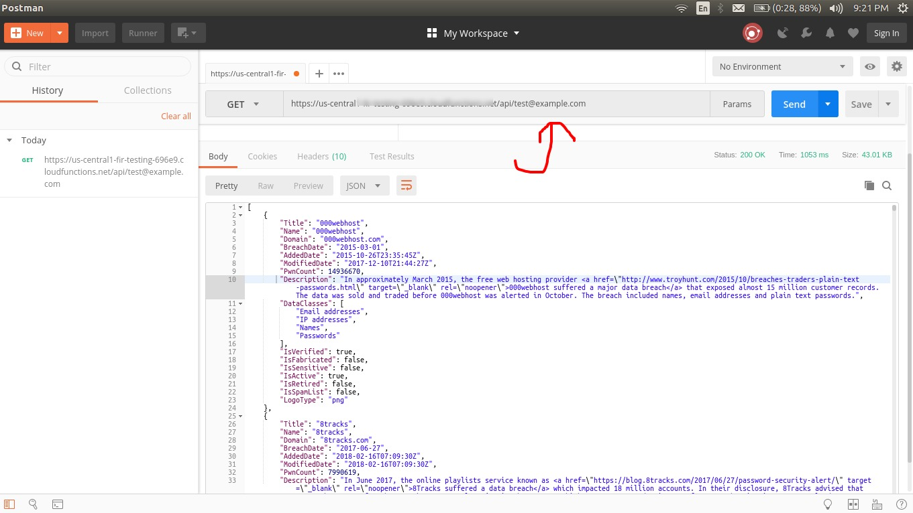

# Firebase Cloud Functions (Rest API)

## ';--have i been pwned? Rest API access (CORS) from web browsers. [Official site](https://haveibeenpwned.com/)

### Have you been hacked ?

This small **Rest API** uses **haveibeenpwned.com** API to check your email account in the major  **breaches**.

### Installation and Usage

#### Clone this repo

```bash
git clone https://github.com/kumarsandeep91/firebase-cloud-functions.git
```

#### Navigate inside cloned repo

```bash
cd firebase-cloud-functions
```

#### Install firebase cli tools

```bash
npm install -g  firebase-tools
```

#### Note: make sure you have a working firebase account and a project initialized.

### Firebase authentication. This will open a new tab in your default web browser. Login with proper account (used in firebase)

```bash
firebase login
```

#### Navigate inside functions dir and install dependencies

```bash
cd functions
npm install
```

#### Navigate back to the root folder

```bash
cd ..
```

#### Deploy to firebase

```bash
firebase deploy
```

#### Go to your firebase dashboard and copy endpoint from there


#### Finally Test your api (Use valid endpoint from your firebase dashboard)

```bash
curl https://us-central1-xxxxxxxxx.cloudfunctions.net/api/test@example.com
```

#### Test through postman

